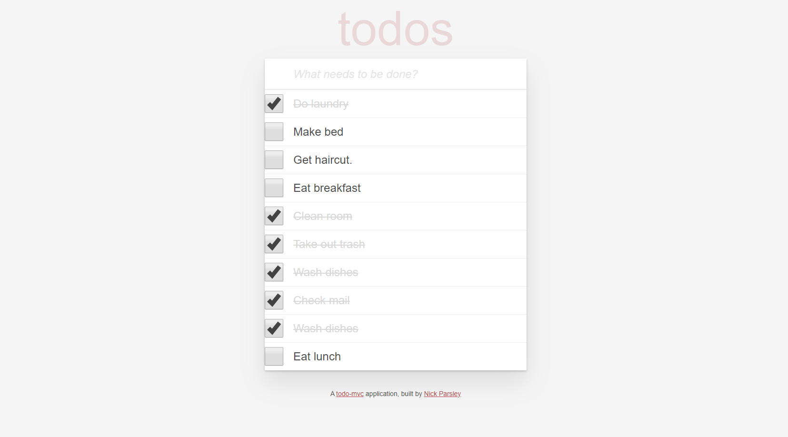
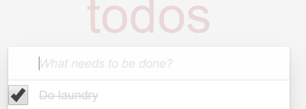
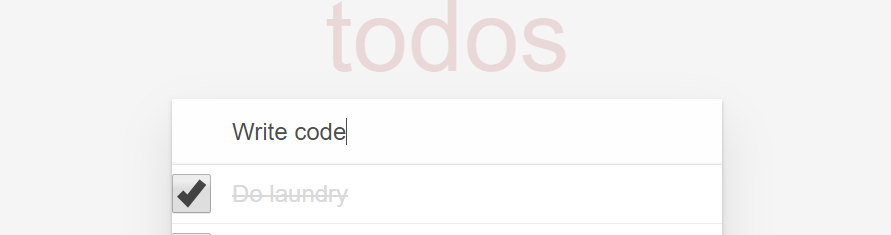
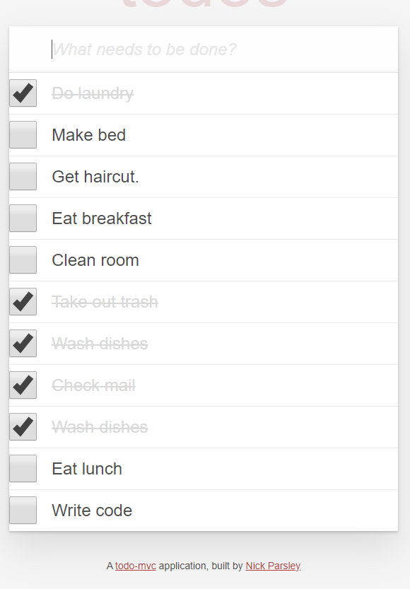
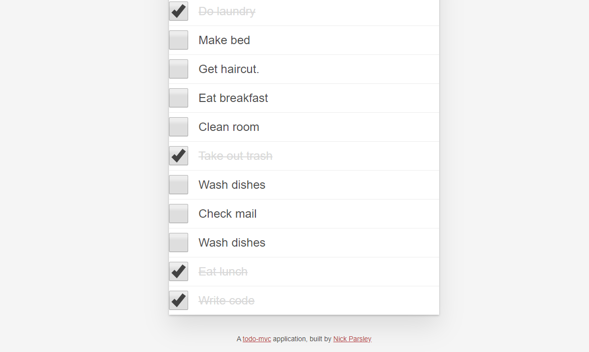

# OVERVIEW

* Application with a fluid user interface allowing users to rapidly add dynamic content.

# LANDING PAGE

* The user will be sent to the landing page that has a todo list readily availble for the user to edit.

# EDITING TODOS

 

* The user can add an item to the checklist by entering it into the top box.

 

* Items that are completed can be checked off and will become crossed off.
* The user can uncheck an item and it will appear as still needing to be done.
